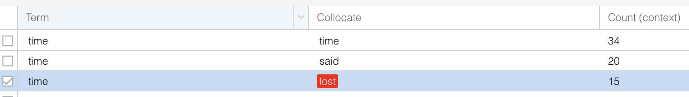
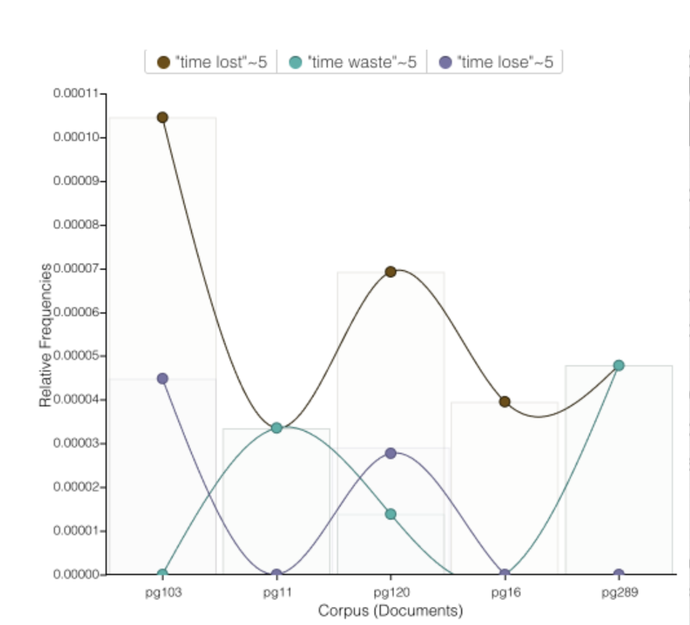

## Assignment 1 - WORKING WITH A CORPUS (draft)

## Introduction
At first, I was planning to use Filipino revolutionary texts from the Philippine Revolution. However, I faced challenges along the way. When I was working with the word cloud, it only showed me Filipino sentence markers instead of meaningful words, which made it hard to get useful insights. Now, my focus has shifted to exploring books about adventure and escaping ordinary life, such as the following:

* _Alice’s Adventures in Wonderland_ (11)
* _Peter Pan (Peter Pan and Wendy)_ (16)
* _The Wind in the Willows_ (289)
* _Treasure Island_ (120)
* _Around the World in Eighty Days_ (103)

Out of these texts, I only knew two: Alice’s Adventures in Wonderland and Peter Pan. I knew both stories revolved around escaping ordinary life or going on adventures. I wanted to understand what makes these stories feel like travelling or going on an adventure, what it’s like to be in a completely new world, to step out of your usual bubble, and what usually happens during these kinds of adventures. Alice’s Adventures in Wonderland is a fantasy tale. It takes its readers to a strange world where dreamlike situations unfold. In Peter Pan, they make their escape through a window and soar to Neverland, where they start their adventure.

I wasn't sure what other texts to use, so I asked ChatGPT. It helped me find similar stories from Project Gutenberg that matched these two. That’s how I ended up adding three more texts. I didn’t know what the other stories were all about, but they seemed to focus on travel or adventure. So I took the risk and included them, then looked for similarities and interesting points across all of the texts, especially in how they present travelling, entering new worlds, and experiencing adventure.

## ANALYSIS AND TOOLS (Voyant Tools and RMarkdown)

When I started placing all of the texts in both Voyant Tools and RMarkdown and exploring them, the word cloud mostly showed random words from the books. The word cloud is also dominated by dialogue and character names such as “said,” “Alice,” and “Peter,” which reflects the narrative nature of the texts. Because of this, it was harder to immediately see deeper themes just from the most frequent words.  I could see some words that I could connect to travel and adventure, but there weren’t many of them. Because of this, I decided to manually look for words in Voyant Tools like _journey, dream, adventure, world, danger,_ and _wonder_, terms that I could relate more clearly to travelling and adventure.

![word cloud] (../assets/images/WordCloudRMarkdown.png "R Markdown Word Cloud")

However, when I looked more closely at the texts, I noticed that one of the most consistent words across all five books is “time.” Even if it is not always the most frequent word, it appears in all of them. This led me to think that time plays an important role in adventure, since it creates a sense of urgency or pressure to act and experience things while you still can. Ideas like time lost or time wasted suggest that characters are pushed to leave their ordinary lives, go on adventures, and explore new worlds.

I also explored the collocates table, and I noticed that some words associated with “time” were highlighted in red. This made me curious, so I decided to graph these collocates together to see if there was a pattern across the texts. I was thinking that maybe these words suggested something deeper, like the idea that not travelling or not using your free time well could lead to losing or wasting time.

When I looked at the results, I noticed that phrases like “time lost” appeared as common collocates across the texts. This stood out to me because it connects to the idea that time is something valuable, and once it is gone, it cannot be taken back. This could suggest that there is a concern with wasting time, and it made me think that the idea of adventure might be connected to making the most out of time.

At the same time, I am aware that I am only doing distant reading, so I cannot fully confirm what the authors intended to say. However, seeing these repeated collocates made me more curious about how time is represented in these stories, and whether it plays a role in pushing characters to leave their ordinary lives and experience something new. However, since I am only using distant reading and collocate patterns, this is not a definite conclusion, but it suggests a possible connection between time, urgency, and the idea of going on adventures.

Overall, even if the word cloud does not directly highlight adventure-related words, looking deeper into the texts shows that themes like time, journey, and escape are still present across all five works.

## INTEGRATING COURSE MATERIALS 

## REFLECTION

## REFERENCES